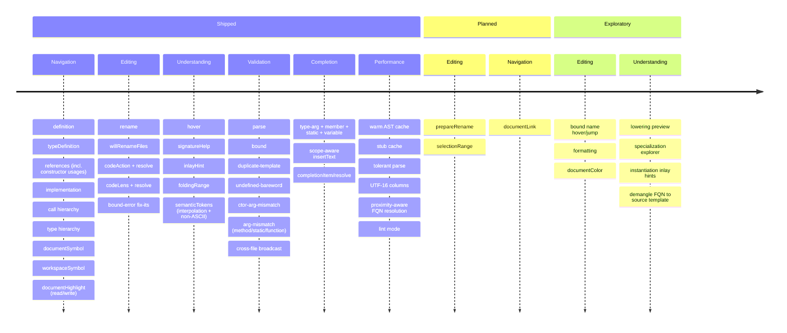

# Roadmap

Forward-looking inventory for the `xphp` Language Server. Intended for `php`
developers working with `xphp` generics: what the LSP delivers today, what
lands next, and what's still being scoped.

1. **Shipped** -- already in production, exercised by the test suite. Full
  descriptions in [`README.md`](../README.md#features).
2. **Planned** -- design is understood, no open questions. Effort sized as
  T-shirt sizes (S / M / L).
3. **Exploratory** -- value is real but the shape isn't. Each item carries a
  checklist of open questions, prior art, and a proposed initial step.

---

## Out of scope

### Native non-LSP integrations

The LSP is the canonical delivery channel. Editor-specific bindings should
consume LSP, not bypass it.

### Static analysis tools

Out of scope for the LSP itself -- those tools have their own LSP wrappers and
the user can stack them.

### IDE-specific integrations

Any features that would depend on the implementation details of a specific IDE.

e.g. "Extract method", "Inline variable", and similar refactoring operations
**MUST** be handled via IDE plugin/extension on top of the LSP features.

--- 

## Overview

Features grouped by theme, not chronological or priority ordering:

---

## Recently shipped

Moved out of Planned / Exploratory since the last revision (exercised by the
test suite; full descriptions to fold into [`README.md`](../README.md#features)):

- **xphp 0.2.x generics** -- the turbofish call-site syntax
  (`new Box::<T>()`, `Foo::method::<T>(...)`) is understood across completion,
  hover, signature help, semantic tokens, and diagnostics. Composite bounds
  (intersection `T : A & B`, union `T : A | B`, and F-bounded `T :
  Comparable<T>`) are rendered in hover and respected by type-argument
  completion (a candidate must satisfy every leaf of an intersection, any leaf
  of a union). Default type arguments (`class Box<T = X>`,
  `class Pair<A, B = A>`) may be omitted at a call site without a false
  "missing type argument", with the effective type substituted into parameter
  checks. Variance markers (`out T` covariant, `in T` contravariant) are shown in
  hover. Instance-method turbofish (`$obj->m::<T>(...)`) binds its type
  argument for argument checking; variable turbofish over an unknown callee is
  conservatively skipped. Generic closures and arrows (`fn<T>(…)`,
  `function<T>(…)`) highlight their declaration clause and body-level `T`
  references as type parameters.
- **Argument-type checker V2** -- a new `xphp.arg-mismatch` diagnostic extends
  the constructor check to `$obj->m(...)`, `Cls::m(...)`, and `freeFn(...)`, with
  conservative "simple-locals" inference for `$var` arguments assigned from a
  literal / `new` earlier in the same scope.
- **Cross-file diagnostic broadcast** -- after a workspace pass, diagnostics are
  re-published for every *other* open document whose results changed
  (per-URI signature-guarded against edit storms), so a dependent flags / clears
  without being touched.
- **On-save authoritative diagnostics** -- on save, the xphp compiler's own
  whole-project validator (`Compiler::check()`, the engine behind `xphp check`)
  runs in-process over the manifest's source set and its findings are merged into
  the published diagnostics. This reaches what the per-buffer tier structurally
  cannot -- grounded, call-argument closure conformance and cross-file generic
  errors -- with zero duplicated validation logic (the compiler stays the single
  source of truth).
- **Bound-error fix-its** -- a `Generic bound violated` diagnostic now offers
  "Add `implements \Bound` to `<class>`" (cross-file edit on the concrete class)
  and "Change type argument to `<Candidate>`" (bound-satisfying workspace types,
  scalars included).
- **Proximity-aware FQN resolution** -- the filesystem index covers the whole
  tree (the `test/fixture` exclusion is gone) and resolves a duplicated FQN to
  the declaration nearest the requesting file; the bound-check hierarchy is
  single-sourced the same way.
- **Constructor usages** -- `new X(...)` is tracked as a reference to
  `X::__construct` in Find Usages, the code lens, and document-highlight.
- **Semantic tokens** -- interpolated `"… $x …"` strings split into string +
  variable spans, and token lengths are UTF-16 code units (non-ASCII-correct).
- **Document highlight** -- read vs. write kind (declaration / assignment =
  write, use site = read).

---

## Planned

Known shape, no open design questions. Listed in rough priority order.

### `prepareRename` -- pre-fill the rename dialog (S)

Currently, the editor pops the rename dialog with an empty input and lets the
user type the new name from scratch. `prepareRename` returns the symbol's
current span so the dialog opens pre-filled and the user just edits in place.
One handler, one AST walk to find the identifier under the cursor.

### `selectionRange` -- Ctrl+W expand-selection (S)

`textDocument/selectionRange` returns a chain of enclosing AST scopes for each
cursor. PhpStorm and VS Code both bind Ctrl+W / Ctrl+Shift+W to it.
Implementation is a tree walk producing `SelectionRange { range, parent }` per
anchor.

### `documentLink` -- clickable URLs in comments (S)

`textDocument/documentLink` returns ranges + URIs for URLs and PSR-4-style
references inside comments / docblocks. Editors underline them and `Cmd+Click`
opens. Low value compared to the above, listed for completeness.

---

## Exploratory

Each item has real user value but the design surface isn't pinned down.
Open questions, prior art, and a proposed initial step are captured per item;
settling those is a prerequisite to any implementation work.

### Lowering preview -- "show me the generated PHP"

**What it'd do.** A code lens or peek-window above any `new Foo::<X>(...)` site
that opens the generated PHP for that specialization, side-by-side with the
source. Same affordance for generic method calls.

**Open questions.**

- Where do the generated sources live at edit time? The compiler writes to
  `var/dist/`; should those be surfaced as-is, or re-lowered on demand?
- How is the preview kept in sync as the source template changes? Re-lower on
  debounce, or invalidate on `didChange`?
- Webview / panel / lens-popup -- which surface fits PhpStorm and VS Code
  without diverging?

**Prior art to study.** Roslyn's "Show IL" feature; Rust analyzer's
"View Hir" / "Expand Macro Recursively" peek; TypeScript's "Run
Generic Inference" debugging view.

**Initial step.** A single read-only code lens that displays the
contents of `var/dist/<file>.php` for a hard-coded file is enough
to validate round-trip latency at typical project sizes before
the dynamic re-lowering path is designed.

### Specialization explorer -- every concrete `Box<X>` for a template

**What it'd do.** Cursor on `class Box<T>`, open a tool window that
lists every `Box<Tag>`, `Box<User>`, `Box<int>` instantiation across
the project, grouped by call site.

**Open questions.**

- VS Code has no native "tool window" concept beyond webviews;
  what's the best surface that doesn't diverge from PhpStorm?
- The `Registry` already knows the answer, but it's a per-session
  in-memory map. Persist, or re-derive on demand?
- What's the right grouping when one instantiation is reachable
  through multiple call sites?

**Prior art to study.** IntelliJ's "Hierarchy" toolwindow; PhpStorm's
"Type Hierarchy" but for type-args rather than supertypes. C++ tools'
template instantiation diagnostics.

**Initial step.** A server-side handler that, given a template
FQN, returns the `Registry`'s list of concrete instantiations,
exposed through `workspace/executeCommand xphp.listInstantiations`.
Prototype consumption from a single client (PhpStorm) before
unifying.

### Instantiation inlay hints -- show the specialized FQN inline

**What it'd do.** Render `// → Box_T_d59a1...` (or a shortened
hash) as an inlay hint at every `new Box::<X>(...)` site so the
specialization a given call resolves to is visible without leaving
the editor.

**Open questions.**

- Hash characters are noise to read. Render the human-readable
  `Box<App\Models\Tag>` form instead? At what verbosity setting?
- Does this fight with PhpStorm's existing inlay-hint UX or
  complement it?
- Hint placement: end-of-line, after the `>`, or before the `(`?

**Prior art.** Rust analyzer's chained-call type hints;
PhpStorm's existing parameter-name hints.

**Initial step.** A new inlay-hint kind alongside the existing
variable-type one, gated by a config flag and validated against
the bundled playground fixtures.

### Reverse-map mangled FQN back to source template

**What it'd do.** When a stack trace or generated-PHP error
mentions `\XPHP\Generated\App\Containers\Box\T_d59a1...`, the
editor offers Ctrl+Click on that string to jump to `class Box<T>`
in the source.

**Open questions.**

- Surface origin: stack traces in run output? Manual paste into a
  search? A "Reveal source template" action on a hover over the
  mangled name in generated PHP?
- Hash length is configurable per project; how should resolution
  behave when two projects use different hash lengths?

**Prior art.** Java's stack-trace mangled-name resolution in
IntelliJ; Rust's `rustc-demangle` for symbol names.

**Initial step.** Expose the FQN → template lookup as a server
method `xphp.demangle`. Prototype consumption in PhpStorm's
"Analyze stacktrace" dialog as a transformation pass.

### Hover / jump on bound names in template headers

**What it'd do.** Cursor on `Stringable` inside
`class Box<T: \Stringable>` should hover the interface and Ctrl+Click
to its declaration. Today the `<...>` clause is stripped by the
XphpSourceParser before nikic sees the source, so no AST node is
positioned over the bound text.

**Open questions.**

- The parser strips the clause for a reason: it's not valid PHP
  and would crash nikic. Re-emit the bound as a synthetic `Name`
  node with the original source span attached? Or extend the
  LSP-side `AstPositionResolver` to recognise the bound region by
  string-matching?
- Same question for type-args: cursor on `T` inside
  `<T: \Stringable>` -- should that resolve as a type-param
  declaration?

**Prior art.** TypeScript LSP's handling of `<T extends U>`
positions; nikic's existing attribute system for source-span
retention.

**Initial step.** Detect the bound region via TextDocument regex
(XphpSourceParser already knows the strip ranges) and synthesize
a definition response without changing the parser. Hover follows
the same approach independently.

### `textDocument/formatting` + `rangeFormatting` + `onTypeFormatting`

**What it'd do.** Format-on-save for `.xphp` files.

**Open questions.**

- An xphp formatter doesn't exist yet. Either ship the PHP
  formatter (php-cs-fixer / nikic pretty-printer) over the
  stripped form, or write an xphp-aware formatter that preserves
  `<T>` clauses verbatim -- which one fits best?
- If a PHP formatter handles the stripped form, how should the
  generic clause round-trip without being eaten as a syntax error?

**Prior art.** Prettier's PHP plugin; PhpStorm's built-in
formatter when generics are present in PHPDoc.

**Initial step.** Formatter survey before any LSP plumbing -- the
formatter question gates the rest.

### `textDocument/documentColor` + `colorPresentation`

**What it'd do.** Detect color literals (`#fff`, `rgb(...)`) in
strings and surface a color picker on hover.

**Open questions.**

- Is there a meaningful PHP use case beyond CSS-in-PHP / template
  libraries?
- Listed for completeness; the value isn't validated yet, and the
  item should drop off entirely if no PHP-shaped use case
  materialises.
